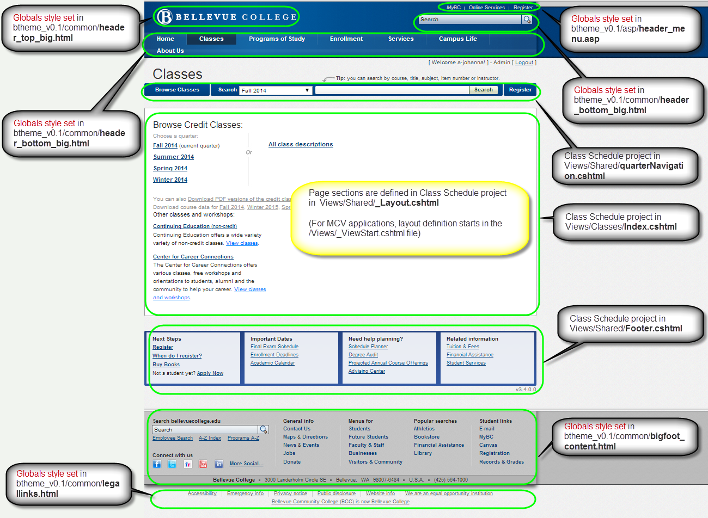
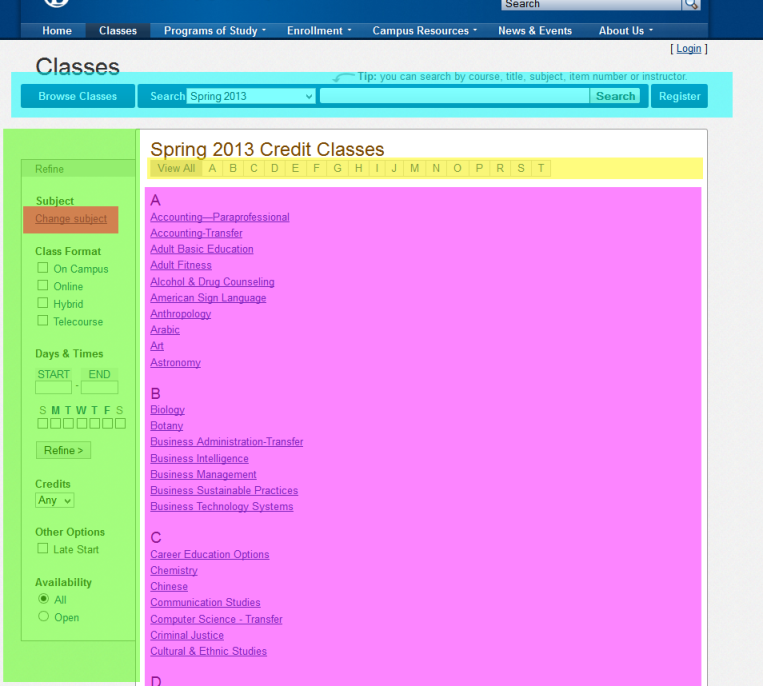
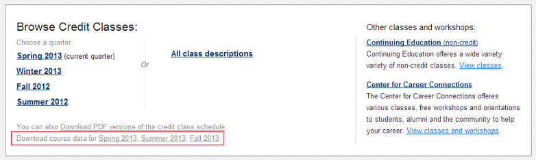
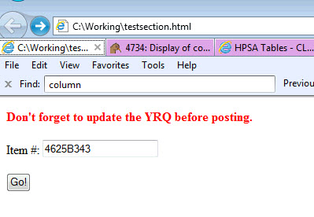
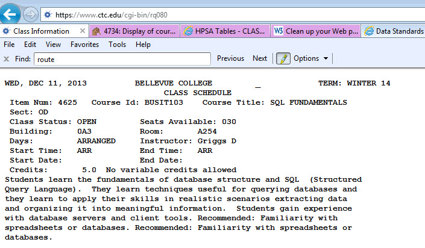

<span id="class-schedule"></span>
# Class Schedule
---

- [Class Schedule](#class-schedule)
- [Statement of need](#statement-of-need)
  - [Problem](#problem)
  - [Goal](#goal)
- [Statement of intent](#statement-of-intent)
  - [Title](#title)
  - [Stakeholders](#stakeholders)
  - [Expected scope/scale/size](#expected-scopescalesize)
- [Current status](#current-status)
- [Requirements](#requirements)
  - [Displaying of Course Descriptions](#displaying-of-course-descriptions)
- [Roadmap](#roadmap)
- [Technologies](#technologies)
  - [Resources](#resources)
  - [Source control](#source-control)
  - [Deployment Notes](#deployment-notes)
  - [Configuration settings](#configuration-settings)
    - [Authentication and authorization](#authentication-and-authorization)
    - [connectionStrings](#connectionstrings)
    - [applicationSettings](#applicationsettings)
      - [appSettings](#appsettings)
    - [ctcOdsApiSettings](#ctcodsapisettings)
    - [ctcAutomatedFootnoteSettings](#ctcautomatedfootnotesettings)
    - [Caching](#caching)
    - [Application logging](#application-logging)
    - [Misc. other settings](#misc-other-settings)
  - [Development](#development)
    - [Initial setup](#initial-setup)
    - [Application architecture/design](#application-architecture-design)
      - [Home Page Layout](#home-page-layout)
      - [YRQ Logic](#yrq-logic)
      - [Routes](#routes)
        - [/classes/YearQuarter](#classesyearquarter)
        - [/classes/Api/Export/YearQuarter](#classesapiexportyearquarter)
      - [Search](#search)
        - [Search Catalog](#search-catalog)
        - [Perform Search](#perform-search)
      - [Export](#export)
        - [Behavior](#behavior)
        - [Output](#output)
- [References](#references)
- [Troubleshooting](#troubleshooting)
  - [____ classes are missing!](#____-classes-are-missing)
  - [Subject assigned to wrong Division/Dept](#subject-assigned-to-wrong-division-dept)
  - [Lookup Section info directly from the HP](#lookup-section-info-directly-from-the-HP)
- [Database refactor notes](#database-refactor-notes)

<!-- /TOC -->

<span id="statement-of-need"></span>
## Statement of need

<span id="problem"></span>
#### Problem

The online class schedule is often out of date because its manually created from the print credit class schedule and is manually updated on-demand as departments contact the web office.

<span id="goal"></span>
#### Goal

Create a database driven class schedule that pulls and augments HP data in a way that is browsable, searchable and timely.

<span id="statement-of-intent"></span>
## Statement of intent

<span id="title"></span>
#### Title

Class Schedule (Classes Online)

<span id="stakeholders"></span>
#### Stakeholders

ASMs, Curriculum Information Management Committee

<span id="expected-scopescalesize"></span>
#### Expected scope/scale/size

<span id="current-status"></span>
## Current status

SEE TFS?

<span id="requirements"></span>
## Requirements

SEE TFS

<span id="displaying-of-course-descriptions"></span>
### Displaying of Course Descriptions

#### On the YearQuarter/Subject page (e.g. [classes/Summer2013/ACCT](http://bellevuecollege.edu/classes/summer2013/acct))

&nbsp;&nbsp;&nbsp;&nbsp;Don't display any course descriptions unless a Custom Descriptions (entered via the CMS functionality) exists. If so, display that custom description just below the course heading.

#### On the Search results page

Always display Course descriptions. If a custom description does not exist, display the active Course description from the ODS.

<span id="roadmap"></span>
## Roadmap

* 0.5
  * Launch Beta of schedule
* 1.0 (clean up)
* 2.0 (clean up)
* 3.0
  * Search improvements
  * speed up cms note creation
  * clean up facets
  * previous course name connection
  * Develop Admin Dashboard
  * Seat availability improvements
  * crosslist classes
  * cleanup databasers
* 4.0
  * manage launch dates
  * better error handling
  * Make responsive design
  * implement ads
  * integrate with enrollment deadlines
  * search improvements
* 5.0+
  * integrate with degree requirements data
  * student views
  * integrate with student historical course info

<span id="technologies"></span>
## Technologies

* [ASP.NET MVC3](http://www.asp.net/mvc/mvc3), .NET 4 (C#)
  * **NOTE:** If using Visual Studio 2010, MVC3 must be separately installed from the link above - otherwise VS will report "project type is not supported" 
* MS SQL Server

<span id="resources"></span>
#### Resources

|  | URL | Server | App Pool identity | Database |
| :--------------------: | -------------------------------------------------- | ---------------------- | ------------------------- | ----------------------------------------------------------------------------------|
| **Production** | https://bellevuecollege.edu/classes/ | HAM/BACON | CAMPUS\w-bc-classschedule | PRUSSIK\ODSDATA..ClassSchedule |
| **Test/QA** | https://bellevuecollege.edu/classesqa/ | HAM/BACON | CAMPUS\w-bc-classscheduleqa | PRUSSIK\ODSDATA..ClassScheduleTest |
| **Dev** | (local workstations) | N/A | N/A | TESTMSSQL\ODSDATA..ClassScheduleDev |

<span id="source-control"></span>
#### Source control
Source code for this project is on the [wacollabcoop](https://wikiwiki.bellevuecollege.edu/index.php?title=Wacollabcoop&action=edit&redlink=1) TFS server.

<span id="deployment-notes"></span>
#### Deployment Notes
When deploying Class Schedule follow the [standard deployment procedure](https://wikiwiki.bellevuecollege.edu/wiki/Software_Development_Standards#Deployment) with the following additions:

1. IF YOU HAVE UPDATED THE [CtcApi](http://codemastershawn.com/kb/index.php/CTC_API) LIBRARY: After building to a staging folder, modify the built web.config and remove all children of the `<connectionStrings>` element.

<span id="configuration-settings"></span>
##### Configuration settings

<span id="authentication-and-authorization"></span>
##### Authentication and authorization

<span id="connectionstrings"></span>
##### connectionStrings

<span id="applicationsettings"></span>
##### applicationSettings

<span id="appsettings"></span>
##### appSettings

<span id="ctcodsapisettings"></span>
##### ctcOdsApiSettings

<span id="ctcautomatedfootnotesettings"></span>
##### ctcAutomatedFootnoteSettings

<span id="caching"></span>
##### Caching

<span id="application-logging"></span>
##### Application logging

<span id="misc-other-settings"></span>
##### Misc. other settings

<span id="development"></span>
## Development

<span id="initial-setup"></span>
#### Initial setup

Because the Class Schedule is a core application, critical to the college's mission, and is connected to or impacts various other tools and data sets, it requires some additional steps to set up the project for the first time. **NOTE:** These instructions assume you have already configured your local IIS server to host the project when run.

#### Install ASP.NET MVC 3, if necessary

ASP.NET MVC is now on version 4, but the class schedule is still on MVC 3. If you have installed MVC 4 (either alone, or by installing Visual Studio 2012), you will likely receive an error the first time you try to build the project. This is a known issue, and the solution is to (re-)install MVC 3, which you can [download from Microsoft](http://www.microsoft.com/en-us/download/details.aspx?displaylang=en&id=1491&WT.mc_id=aff-n-in-loc--hr). If you are unable to complete the MVC 3 install, see this [article](http://geekswithblogs.net/ranganh/archive/2011/10/26/installing-mvc-3-for-visual-studio-2010-on-windows-developer.aspx).

#### Add virtual folders to IIS

Follow the directions outlined in [Configure project for IIS](https://wikiwiki.bellevuecollege.edu/wiki/Software_Development_Standards#Configure_project_for_IIS) to create a http://localhost/classes URL.

#### Set up the globals directory
The Class Schedule project contains a folder called "globals", but when executing on a server, this folder lives **alongside** the Class Schedule application folder, not as a child directory. It is therefore necessary to set up your local IIS configuration so that this folder can be reached at http://localhost/globals:
1. Open Internet Information Services Manager (inetmgr. exe)
2. Right-click on the Default Web Site node (or the parent node where the Class Schedule application is configured) and select Add **Virtual Directory...**
3.  Enter globals for the **Alias**.
4.  For the **Physical path**, browse to and select the globals folder in your Visual Studio project directory.
5.  Click OK.

#### Workstation-specific .config files

Because the Class Schedule project was developed in collaboration with another college, it is necessary to maintain certain configuration settings separately from the source control repository (which is shared). Download [ClassScheduleWorkstationConfigSettings.zip](https://go.mybcc.net/ir/devcom/projects/schedule/Implementation/ClassScheduleWorkstationConfigSettings.zip) (requires <span style="color: red">[NetID](https://wikiwiki.bellevuecollege.edu/index.php?title=NetID&action=edit&redlink=1) login)</span> and unzip the contents into your project folder - alongside the Web.config file.
If you add settings to these files, upload the new versions back to the [Implementation Document Library](https://go.mybcc.net/ir/devcom/projects/schedule/Implementation/).

<span id="application-architecture-design"></span>
#### Application architecture/design 

This project uses the MCV framework and the Bellevue College "Globals" style set

<span id="home-page-layout"></span>


<span id="yrq-logic"></span>
#### YRQ Logic

The ClassSchedule sets query parameters in its web.config file and makes calls to the ctcODSAPI to retrieve the upcoming, current and past quarters. Quarters are cached for 1 day in the HTTPRuntime.Cache.

The class schedule web.config has the following settings which are used in the ctcAPI code below:

`<yearQuarterminValue="0000"maxValue="Z999"registrationLeadDays="14"cache="60"/>`

Three separate calls are made to load YRQ for the home page:

1. Retrieve current YRQ:

```sql 
SELECT TOP(1) [Extent1].[YearQuarterID] AS [YearQuarterID], [Extent1].[FirstClassDay] AS [FirstClassDay], [Extent1].[LastClassDay] AS [LastClassDay] 
FROM [dbo].[vw_YearQuarter] AS [Extent1] 
WHERE (LastClassDay >= GETDATE() AND YearQuarterID <> 'Z999') --Settings.YearQuarter.Max ORDER BY YearQuarterID 
```

2. Retrieve quarters to list in navigation:

This is for the main page quarter list and the search drop-down. If match between YRQ in this list and the current YRQ from above then (upcoming) or (current quarter) note is added

```sql
SELECT [Project1].[YearQuarterID] AS [YearQuarterID], [Project1].[FirstClassDay] AS [FirstClassDay], [Project1].[LastClassDay] AS [LastClassDay] 
FROM ( SELECT [Extent1].[YearQuarterID] AS [YearQuarterID], [Extent1].[FirstClassDay] AS [FirstClassDay], [Extent1].[LastClassDay] AS [LastClassDay] 
FROM [dbo].[vw_YearQuarter] AS [Extent1] 
LEFT OUTER JOIN [dbo].[vw_WebRegistrationSetting] AS [Extent2] ON [Extent1].[YearQuarterID] = [Extent2].[YearQuarterID] 
WHERE ((([Extent2].[FirstRegistrationDate] IS NOT NULL) AND ([Extent2].[FirstRegistrationDate] <= 'Today + Settings.YearQuarter.RegistrationLeadDays')) OR ([Extent1].[LastClassDay] <= GETDATE())) AND ([Extent1].[YearQuarterID] <> 'Settings.YearQuarter.Max') ) AS [Project1] 
ORDER BY [Project1].[YearQuarterID] DESC
```

3. Retrieve current and upcoming YRQs for administrators to download course data

```sql
SELECT [Project1].[YearQuarterID] AS [YearQuarterID], [Project1].[FirstClassDay] AS [FirstClassDay], [Project1].[LastClassDay] AS [LastClassDay] 
FROM ( SELECT [Extent1].[YearQuarterID] AS [YearQuarterID], [Extent1].[FirstClassDay] AS [FirstClassDay], [Extent1].[LastClassDay] AS [LastClassDay] FROM [dbo].[vw_YearQuarter] AS [Extent1] LEFT OUTER JOIN [dbo].[vw_WebRegistrationSetting] AS [Extent2] 
ON [Extent1].[YearQuarterID] = [Extent2].[YearQuarterID] 
WHERE ((([Extent2].[FirstRegistrationDate] IS NOT NULL) AND ([Extent2].[FirstRegistrationDate] >= 'Today + Settings.YearQuarter.RegistrationLeadDays')) OR ([Extent1].[LastClassDay] >= GETDATE())) AND ([Extent1].[YearQuarterID] <> 'Settings.YearQuarter.Max') ) AS [Project1] ORDER BY [Project1].[YearQuarterID] ASC
```

<span id="routes"></span>
#### Routes

There are three primary ways to get to section/class details:

1. Through the web site navigation (ClassesController)
2. Using the Class Schedule search tool (SearchController)
3. Exporting the section data (ClassSchedulerExporter)(restricted access)

All routes use the same code to query the database (via the ctcODSApi) and create a sections result set. However the ordering of the data is not performed the same. The initial result set is created in the GetSectionsWithSeats() routine in the Helpers.cs class. The columns to retrieve and the order by is defined here.

After this point the ClassController and ClassSchedulerExporter pass the results set directly to the GroupSectionsIntoBlocks() which first sorts the results set and then breaks the sections in the set into groups. These groups are done by CourseID, CourseTitle, and Credits.

The SearchController first trims the result set down to 40 items (this is a page limit hardcoded in the class, const int ITEMS_PER_PAGE = 40;). Then the SearchController passes the trimmed result set to the GroupSectionsIntoBlocks() routine. This may result in unexpected grouping if we don't make sure the order by is the same in both the GetSectionsWithSeats() and GroupSectionsIntoBlocks()

#### /classes/YearQuarter


#### Ex: <span style="font-weight: normal">http://bellevuecollege.edu/classes/Spring2013</span>




#### Legend <span style="font-weight: normal">(partial views by color in the image above)</span>

* ##### <span style="color: cyan">CYAN</span><span style="font-weight: normal">: Views/Shared/quarterNavigation.cshtml</span>
* ##### <span style="color: DarkGreen ">GREEN</span><span style="font-weight: normal">: Views/Shared/advancedFacetedSearch.cshtml</span>
* ##### <span style="color: DarkOrange">ORANGE</span><span style="font-weight: normal">: Views/Shared/subjectNavigation.cshtml</span>
* ##### <span style="color: gold">YELLOW</span><span style="font-weight: normal">: Views/Shared/a_to_z.cshtml</span>
* ##### <span style="color: magenta">PINK</span><span style="font-weight: normal">: Views/Shared/subjectList.cshtml</span>

#### /classes/Api/Export/YearQuarter

#### Ex: <span style="font-weight: normal">http://bellevuecollege.edu/classes/Api/Export/B234</span>

The Class Schedule allows Section data for any quarter to be output to a downloadable text file format. Links to export the current quarter and/or current registration quarters are accessible on the Class Schedule home page to anyone logged in as either an Admin or Editor. The export content is in the /Views/Classes/Index.cshtml file and action in /Controllers/ApiController.cs, most work is done in /Common/ClassScheduleExporter.cs



<span id="search"></span>
#### Search

<br />

#### Search Catalog
---

For both Class and Course searches a scheduled SQL job runs daily at 3AM that calls a stored procedure. This stored procedure,usp_PopulateClassSearchTables, truncates and reloads both the ClassSearch and CourseSearch tables with data from the ODS database.

**ClassSearch:** The ClassSearch table contains four columns that are parsed for the search parameters. These four columns, searchgroup[1-4], contain the following ODS data and the results set is loaded in the same numeric sequence with the search results from searchgroup1 on top and the results from searchgroup4 on bottom. **There is no explicitly defined order by** even though the contains fuction does return a rank value. Searches done using this table via the stored procedure are logged into the SearchLog table.

The searched columns are loaded with the following ODS data:

* searchgroup1 = vw_Class.courseID + vw_Class.itemnumber + isNULL(vw_Course.CourseTitle2, vw_Class.coursetitle) + vw_CoursePrefix.title
* searchgroup2 = (vw_Employee.Firstname + vw_Employee.Aliasname + vw_Employee.lastname) + vw_CourseDescription.description
* searchgroup3 = vw_Footnote.footnotetext
* searchgroup4 = SearchGroup1 + SearchGroup2 + SearchGroup3

**CourseSearch:** The CourseSearch table contains one column that is parsed for the search parameters and the search results are order by the searchrank this is a property of the contains function. Searches done using this table via the stored procedure are not logged.

The searched columns are loaded with the following ODS data:

* CourseInfo = vw_Course.CourseID + vw_Course.CourseTitle2 + vw_CourseDescription.CourseDescription + vw_CourseDescription2.CourseDescription2

<br />

<span id="perform-search"></span>
#### Perform Search
---

There are additional stored procedures, usp_ClassSearch and usp_CourceSearch, to handle the searching. They receive a query string and YRQ ID and return a listing of results. A system 'contains' function (http://msdn.microsoft.com/en-us/library/ms187787(v=sql.105).aspx) is used to perform a full text search for the search parameter including prefixes, there are no additional search features done such as weight or proximity.

<span id="export"></span>
#### Export

The Export feature exists as a means of exporting all Class Schedule section data for a given quarter, into a text file. Each piece of data is attributed with identifying tags, which allows for easy editing and eventual import into Adobe InDesign. The primary use of this feature is to support the construction of the print version of Class Schedule.

To access the feature, you must be authenticated as either an Admin or Editor. Links to export the current quarter, or current registration quarters are exposed from the [Class Schedule homepage](http://bellevuecollege.edu/classes), or via the Export route (see route documentation).

<br />

<span id="behavior"></span>
#### Behavior
---

Below is a list of special rules and behaviors performed on the course data when exporting. This list may explain why certain data is not being exported as one might expect.

* The file is transferred to the client with the HTTP content header matching the text/plain MIME type, an .RTF extension, and UTF-8 encoding.
* No sections with a course prefix (ex: ENGL, ACCT, etc.) which has not been assigned (merged) to a subject will be output. To successfully output sections with a particular prefix, ensure that the prefix has been merged to one subject
* No sections belonging to a subject which has not been assigned either a department or division will be output. To make sure a subject has been assigned to a department or division, edit the subject using the CLass Schedule.
* All section footnotes common to all sections belonging to a given course are grouped and displayed as course footnotes under the course title, rather than under each section individually.
* Instead of displaying a footnote flagging each hybrid section, if a course has multiple hybrid sections in a row, the footnote is placed after the last hybrid section in the list.
* All sections are sorted using the following sort order:

1. Sort by division title
2. Sort by subject title
3. Sort by course number
4. Sort linked to the top
5. Sort variable credit courses to the top
6. Sort by credits (descending)
7. Sort by section start time
8. Sort remaining sections into the following groups:
   1. On campus sections
   2. Hybrid sections
   3. Online sections
   4. Telecourse sections
9. Finally, sort all ties by section code (ascending)

<br />

<span id="output"></span>
#### Output
---

Below is a legend defining each tag or special marker used to define data in the exported text file.

* ``` <CLS9> ``` -- Division title.
* ``` <CLS1> ```  -- Subject title.
* ``` <CLSP> ```  -- Subject intro.
* ``` <CLS2> ``` -- Course header, or linked section headers.

[linked section headers - An item number linking a class to another class in the next quarter. Automatic registration into the linked class occurs in batch registration for students enrolled in the class containing the ITM-YRQ-LINK.]

* ``` <CLS3> ``` -- HP footnotes, course footnotes, CMS footnotes, and common Section footnotes.

#### Section Marker Tags

* ``` <CLS5> ```  -- Default Section tag.
* ``` <CLS6> ```  -- Evening & Weekend Section.
* ``` <CLSA> ```  --  Section to be arranged.

#### Section Info Tags

* ``` <CLSY> ```  -- Automated footnotes.
* ``` <CLSN> ```  -- Section footnotes.

#### Defaults and Flags

* [h] -- Flags a hybrid Section.
* [online] -- Flags an online Section.
* staff -- Default instructor name if no instructor is assigned to the Section.

<br />

<span id="references"></span>
#### References
---

<span style="color: green">TODO</span>

<br />

<span id="troubleshooting"></span>
#### References
---

<span id="____-classes-are-missing"></span>
#### **____ classes are missing!**

The Class Schedule codebase is complex and there can be a number of things that can potentially cause a course and/or section to not be listed. This section documents various data errors which can cause classes to go missing.

#### Exclusion flags

There are a number of configurable flags which can be set to tell the Class Schedule app to ignore a class record. Although these can be changed at any time (by IR personnel), the following flags are currently set (meaning any records that match these will be ignored):

| **Feild** | **Value** |
| :----------------------: | :--------: |
| **SectionStatusID1** | **X** |
|                      | **Y** |
| **SectionStatusID4** | **M** |
|                      | **N** |

For more information, see [ODS/HP class (section) flags](http://depts.bellevuecollege.edu/helpdesk/kb/odshp-class-section-flags/) (login required).

#### Invalid data in ItemYRQLink

The ItemYRQLink field is used to link courses and sections. This field is expected to either contain a valid Item Number or be empty (NULL in the ODS). A zero (0) in this field, for example, can cause ALL sections of the same course to be ignored - because the application is trying to link them to another section with an item # of zero, which it can't find.

#### Narrowing down logic errors

There are two basic areas that can potentially contain logic errors which would cause classes to not show up:

1. **Getting classes from the database** - a quick way to check this is to add ?format=json to the end of the URL. This will return all the classes formatted as JSON. If this data set includes the missing class (try Ctrl-F), then it's being retrieved from the database correctly - the problem is likely with the logic used in displaying the page:
2. **Generating the page to display** - this will mostly likely require a developer to debug the code which is used to generate the page output.

<span id="subject-assigned-to-wrong-division-dept"></span>
### **Subject assigned to wrong Division/Dept**

In many cases this can be fixed via the CMS user interface, but due to [Bug 4194](https://dev.bellevuecollege.edu/fogbugz/default.asp?4194) these relationships can sometimes get out of sync. If you need to manually create a new Department for a Subject and associate it with an existing Division the following SQL script will do so:

```
<syntaxhighlight lang="sql"> DECLARE @DivisionID INT, @SubjectID INT

SET @SubjectID = /* <-- The SubjectID you want to create a Dept for */ SET @DivisionID = /* <-- The DivisionID to associate it with */

BEGIN TRANSACTION

INSERT INTO [dbo].[Departments]
```
```
       (
       [DivisionID]
       ,[LastUpdatedBy]
       ,[LastUpdated]
       )
```

VALUES

```
		(
        @DivisionID
        , -- DivisionID - int
        '  YOUR NETID HERE  '  /* DON'T FORGET YOUR NETID */
        , -- LastUpdatedBy - varchar(100)
        GETDATE()  -- LastUpdated - datetime
		)
```

IF NOT ``` @@IDENTITY IS NULL BEGIN UPDATE [dbo].[Subjects] SET [DepartmentID] = @@IDENTITY WHERE [SubjectID] = @SubjectID ```

``` COMMIT END ELSE BEGIN PRINT 'IDENTITY is NULL - cannot identify record.' ROLLBACK END </syntaxhighlight> ```

<span id="lookup-section-info-directly-from-the-HP"></span>
#### Lookup Section info directly from the HP

POSTing the following HTML page will retrieve Section data directly from the HP via the WTS interface.

``` <syntaxhighlight lang="html4strict"> <html> ```

```html

<body>
   <form action="https://www.ctc.edu/cgi-bin/rq080" method="POST" enctype="application/x-www-form-urlencoded">
     <input type="hidden" name="request" value="classchd"/>
   
```

<span id="span-stylecolor-reddont-forget-to-update-the-yrq-before-postingspan"></span>
##### <span style="color: red">Don't forget to update the YRQ before posting.</span>

Item #: ``` <input type="text" name="item"/> ```

```
<input type="hidden" name="ayr" value="2013+-+14" />
<input type="hidden" name="sess" value="2+-+fall" />
```

``` <input type="submit" value="Go!"/> ```

```
   </form>
 </body>
```

```
</html> </syntaxhighlight>
```

Save the above code into a local HTML file and open in your browser. You should receive the following form.



On submission you should see results similiar to the following:



<br />

<span id="database-refactor-notes"></span>
#### Database refactor notes
---

Additional information about specific tables:

##### SectonCourseCrosslistings

This table maintains ad-hoc relationships between a Section and one or more Courses. These relationships are needed to describe **I**nter-**D**isciplinary **S**tudies. (e.g. "This section is cross-listed with English 101")